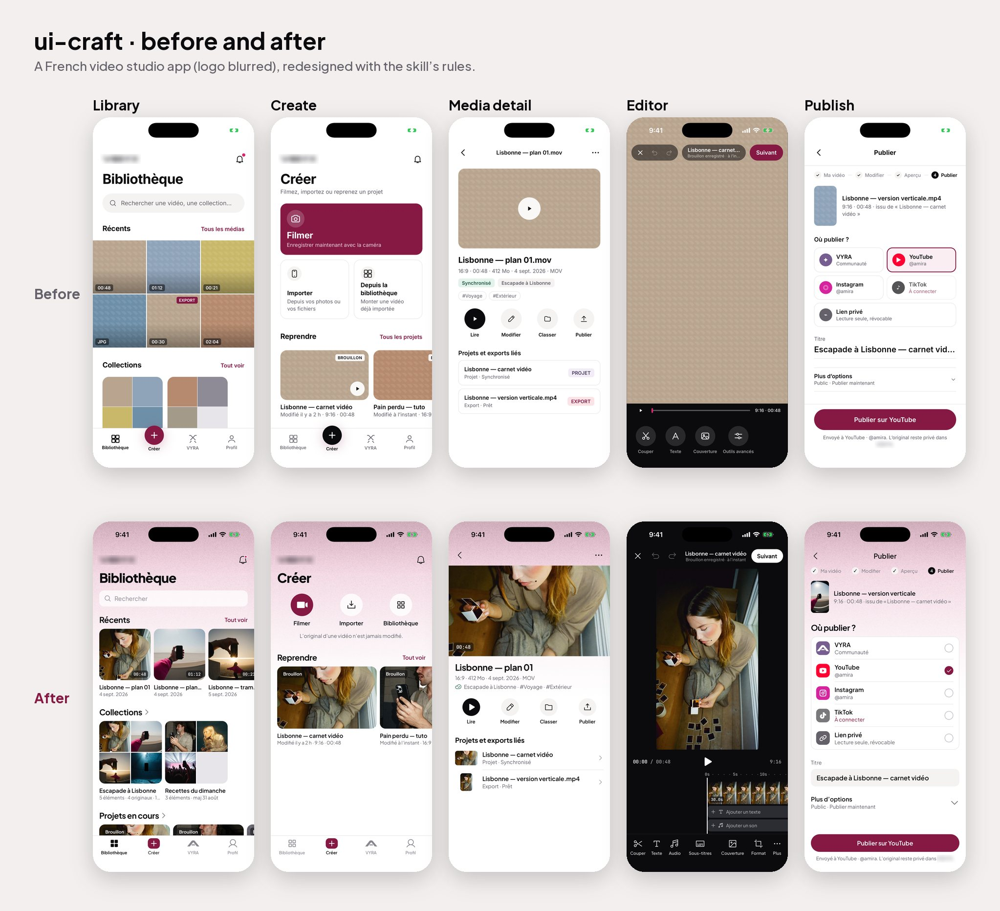
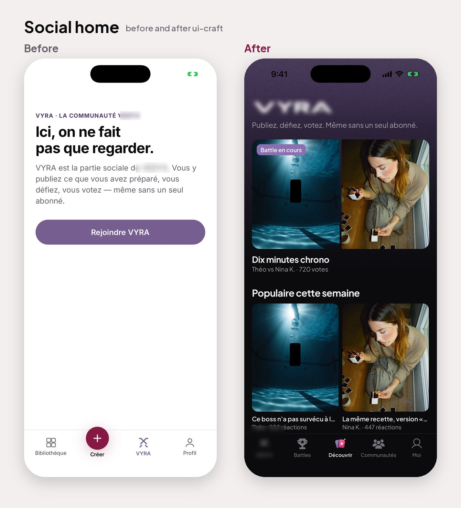

# ui-craft — an agent skill for mobile UI that looks like a real app

**By [Achref Arabi](https://github.com/Achref23illi)** · [LinkedIn](https://www.linkedin.com/in/achraf-arabi/) · [Instagram](https://www.instagram.com/achref.dev/)

[](https://github.com/Achref23illi/ui-craft/stargazers)
[](LICENSE)


Your coding agent reads it before it touches a screen: rules with real numbers, screen
recipes and a fast screenshot review, built from 2,600 screens of 44 apps people love.



<sub>The same app, a French video studio with a social space, before and after applying the skill and one round of review by its product owner (logos blurred).</sub>

**If ui-craft makes your screens better, a ⭐ helps other developers find it.**

## Quick start

```bash
git clone https://github.com/Achref23illi/ui-craft ~/.claude/skills/ui-craft
```

Open Claude Code in your app's repository and ask *"Design the settings screen with
ui-craft"* or *"Review these screenshots with ui-craft: `./shots`"*. Setup for Codex,
Cursor and Gemini CLI is [below](#1--install).

## What's inside

A skill for Claude Code (and any agent that reads `SKILL.md`) built from a study of
44 shipped iOS apps — Spotify, Airbnb, Instagram, TikTok, Apple Music, Apple TV,
Netflix, VSCO, Halide, Denim, Photoshop, Riverside, Moises, Playground, Revolut,
Linear, Notion, ChatGPT, Claude, Uber and more — 2,600 screens read for how they
spend space, how few things they show, and how each element earns its place.

What you get:

- **`SKILL.md`** — the rules with the numbers behind them, a table of reusable
  measurements for a 390-pt screen, nine screen recipes (home with rails, media
  detail, player, editor, publish form, settings, comments, paywall, onboarding),
  a done-checklist and the anti-patterns that separate cheap screens from real ones.
- **`refs/notes.md`** — per-app observations with measurements, app by app.
- **`refs/ux-research.md`** — sourced findings: choices per screen, icon labels, tap targets, typefaces, icon systems.
- **`refs/lessons.md`** — what changed when the research met real screens and a product owner's review, with screenshots in `refs/lessons-img/`.
- **`examples/before-after/`** — one app, before and after, screen by screen.
- **`refs/patterns.md`** — pattern → which apps and screens to look at.
- **`refs/INDEX.md`** — the 44 apps and what each is good for.
- **`refs/screens/` and `refs/sheets/`** — the reference library itself: 2,602 screens
  from the 44 apps and 434 contact sheets of six screens each, so an agent can study six
  real screens in one image read.
- **`scripts/`** — `refs.py` (references for a pattern), `sheet.py` (contact sheets
  from screenshots, for fast reviews), `measure.py` (sizes, gutters and gaps in points
  from a screenshot), `doctor.py` (checks the install and the reference index).
- **`AGENTS.md`** — the same workflow for Codex, Cursor, Gemini CLI and other agents.

## Before and after, screen by screen



Screen by screen: [library](examples/before-after/01-library.jpg) ·
[create](examples/before-after/02-create.jpg) · [media detail](examples/before-after/03-media.jpg) ·
[editor](examples/before-after/04-editor.jpg) · [publish](examples/before-after/05-publish.jpg) ·
[social home](examples/before-after/06-social-home.jpg). What changed and why, with
screenshots, is in [`refs/lessons.md`](refs/lessons.md).

## Setup

### Requirements

- An agent that can read files and run shell commands (Claude Code, Codex, Cursor,
  Gemini CLI…).
- Python 3.9 or later. Pillow for contact sheets: `python3 -m pip install pillow`.
- To review a mobile app: a way to screenshot it (Xcode's iOS Simulator, an Android
  emulator with `adb`, or a browser for mobile web).

### 1 · Install

**Claude Code, for all your projects**

```bash
git clone https://github.com/Achref23illi/ui-craft ~/.claude/skills/ui-craft
```

**Claude Code, for one project only** (committed with the project, shared with the team)

```bash
git clone https://github.com/Achref23illi/ui-craft .claude/skills/ui-craft
```

**Codex, Gemini CLI, Aider and other agents**: clone it anywhere (for example
`~/.agents/ui-craft`) and add one line to the project's `AGENTS.md` (or `GEMINI.md`):

```markdown
Before any mobile UI work, read ~/.agents/ui-craft/SKILL.md and follow its "Start here" section.
```

**Cursor**: clone it into the project (`.cursor/ui-craft`) and create
`.cursor/rules/ui-craft.mdc`:

```markdown
---
description: Mobile UI design and review
globs: ["**/*.tsx", "**/*.swift", "**/*.dart", "**/*.kt"]
---
Read .cursor/ui-craft/SKILL.md and follow its "Start here" section for any screen work.
```

### 2 · Check the install

```bash
python3 ~/.claude/skills/ui-craft/scripts/doctor.py
```

It lists what is present and the mode: **FULL** when the reference sheets are there
(the default after cloning), **RULES** if they were removed to save space. Both work;
FULL adds real reference screens to every answer. Add `--refs` to also check that every
sheet named in `refs/patterns.md` exists (useful after adding your own).

### 3 · Use it

Start a session in your app's repository and ask in plain words. Claude Code loads
the skill from its description; with other agents, mention it.

- "Design the settings screen with ui-craft."
- "Review these screenshots with ui-craft: `./shots`."
- "Restyle the whole app with ui-craft, shared components first."

What the agent does, in order: finds references (`scripts/refs.py`), reads them,
applies the rules with their numbers, checks the lessons, builds, screenshots the
result and runs the checklist.

### 4 · A fast review, by hand

```bash
# iOS Simulator: one screenshot per screen you care about
xcrun simctl status_bar booted override --time 9:41 --batteryState charged --batteryLevel 100 --wifiBars 3 --cellularBars 4
xcrun simctl io booted screenshot shots/01-home.png

# Android emulator
adb exec-out screencap -p > shots/01-home.png

# six screens per image, so the agent reads a whole flow in a few images
python3 ~/.claude/skills/ui-craft/scripts/sheet.py shots

# real numbers in points: side gutters, then what a line down x = 60 pt crosses
python3 ~/.claude/skills/ui-craft/scripts/measure.py shots/01-home.png
python3 ~/.claude/skills/ui-craft/scripts/measure.py shots/01-home.png --col 60

# references for the pattern at hand (--list shows every pattern name)
python3 ~/.claude/skills/ui-craft/scripts/refs.py "home feed"
```

Then: "Review `shots/sheets` with ui-craft." You get a table of the ten findings that
matter most, each with the rule, the measurement and the fix.

### 5 · Extend the reference library (optional)

The repository ships with 2,602 screens and 434 contact sheets. Add your own from
screenshots you have the right to keep: your own apps, apps you screenshot on your
phone for study, exports from inspiration services you subscribe to.

```bash
cd ~/.claude/skills/ui-craft
mkdir -p refs/library/Linear            # one folder per app
# put the app's screenshots in it, then:
python3 scripts/sheet.py refs/library/Linear --out refs/sheets --name 900-Linear
```

Name sheets `<3-digit id>-<App>-<nn>.jpg` (the script adds `-01`, `-02`…). Add the app
to a line in `refs/patterns.md` (for example `… : Linear 01`) and `scripts/refs.py`
will list its sheets for that pattern; `python3 scripts/doctor.py --refs` confirms the
name resolves. `refs/library/` stays out of git.

To save disk space on a machine that only needs the rules, delete `refs/screens/`
and `refs/sheets/`; the skill falls back to RULES mode.

### Update

```bash
git -C ~/.claude/skills/ui-craft pull
```

### Troubleshooting

- **The skill does not trigger**: invoke it by name (`/ui-craft` in Claude Code) or
  mention "ui-craft" in the request; restart the session after installing.
- **`Pillow is missing`**: `python3 -m pip install pillow`.
- **`no local screen library`** from `refs.py`: the sheets were deleted or not checked
  out; `git -C ~/.claude/skills/ui-craft checkout -- refs/sheets` restores them.
- **Blank or white status bar text in screenshots**: set the status bar style per
  screen, and use the simulator's status bar override for clean shots.

## Free for everyone

Made for the community by **Achref Arabi** (2026). Use it, fork it, change it and
ship with it, in personal or commercial work. Issues and pull requests are welcome.

Follow the work: [LinkedIn](https://www.linkedin.com/in/achraf-arabi/) ·
[Instagram](https://www.instagram.com/achref.dev/) · [GitHub](https://github.com/Achref23illi).
If it helped you, star the repo so others can find it.

The reference screenshots in `refs/screens/` and `refs/sheets/` show apps made by
their respective companies and remain their property. They are included for study and
reference only; the MIT licence covers the skill's own text, scripts and images, not
those screenshots.

MIT licensed.
