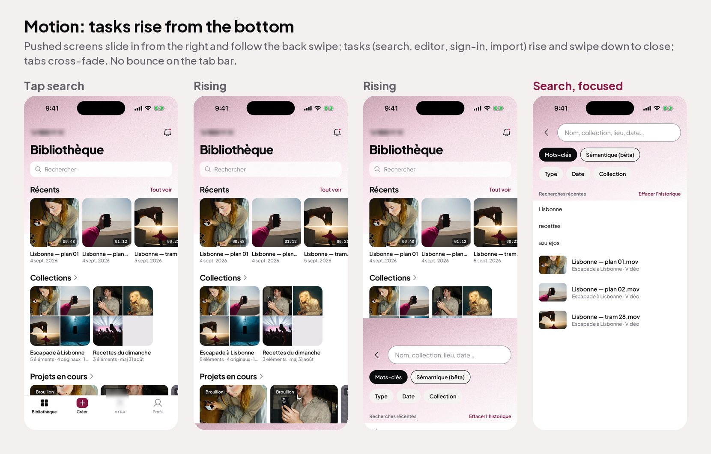
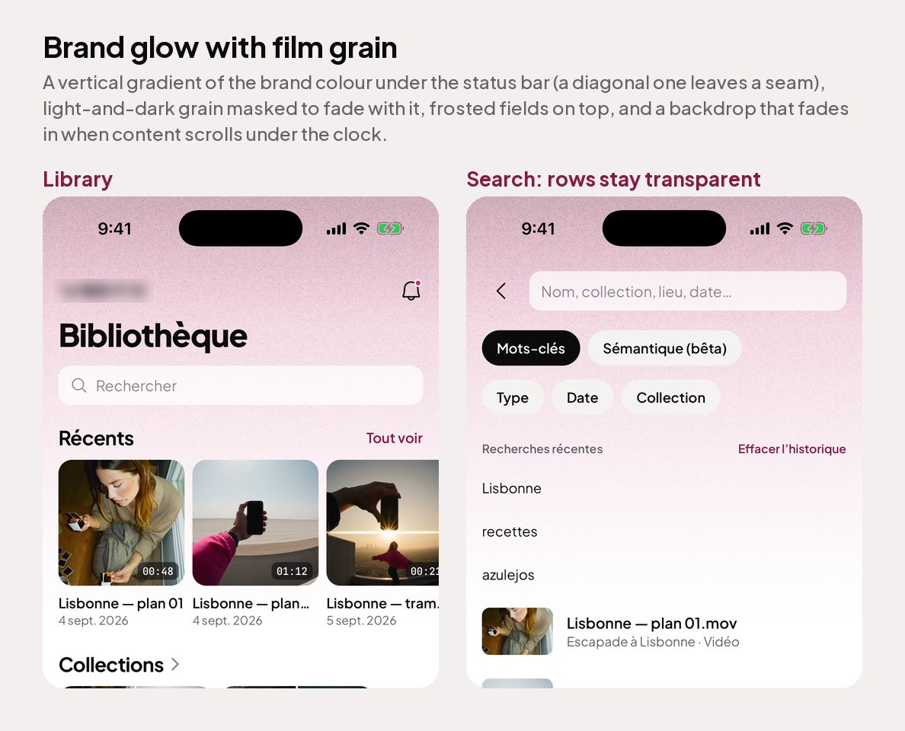
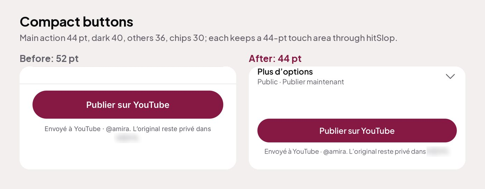
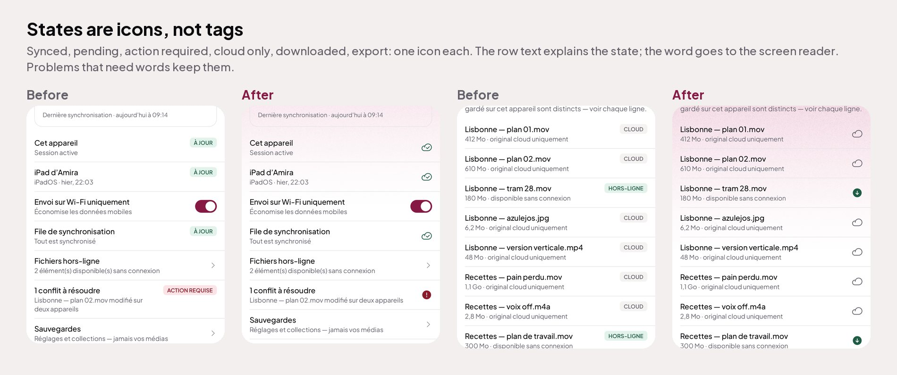
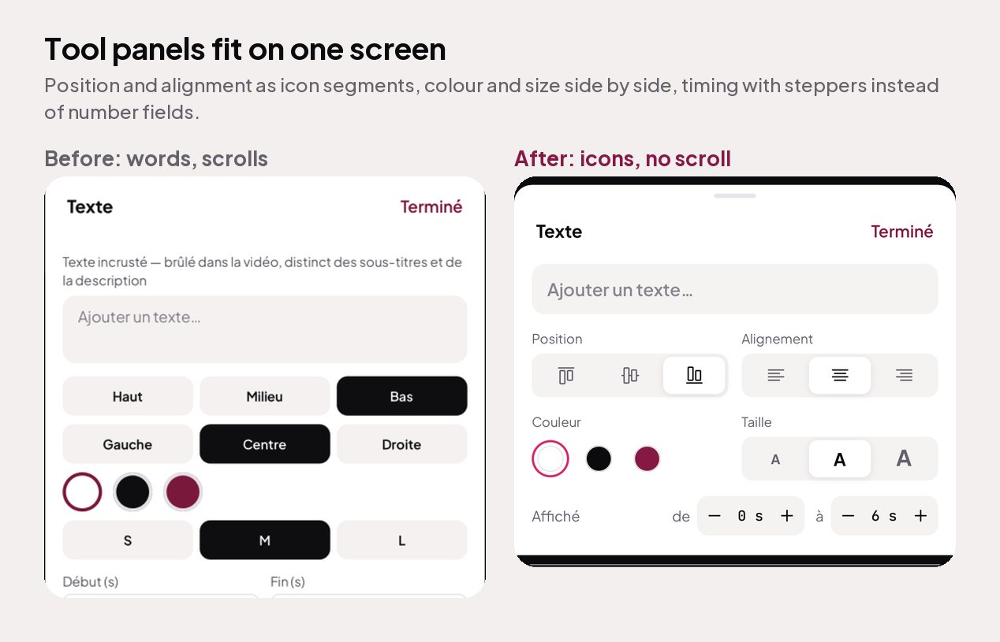
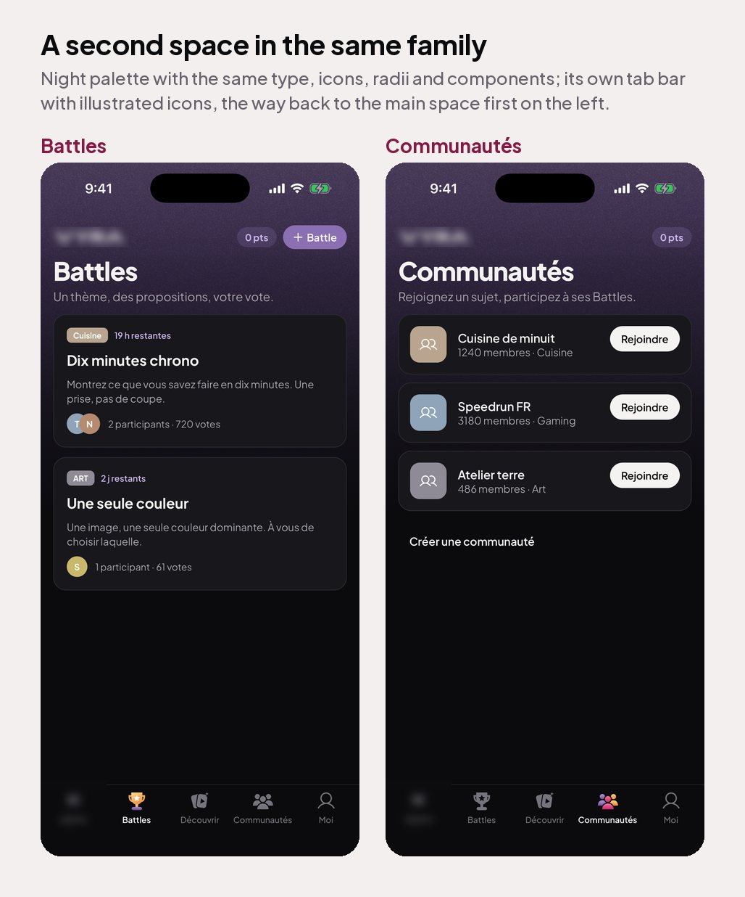
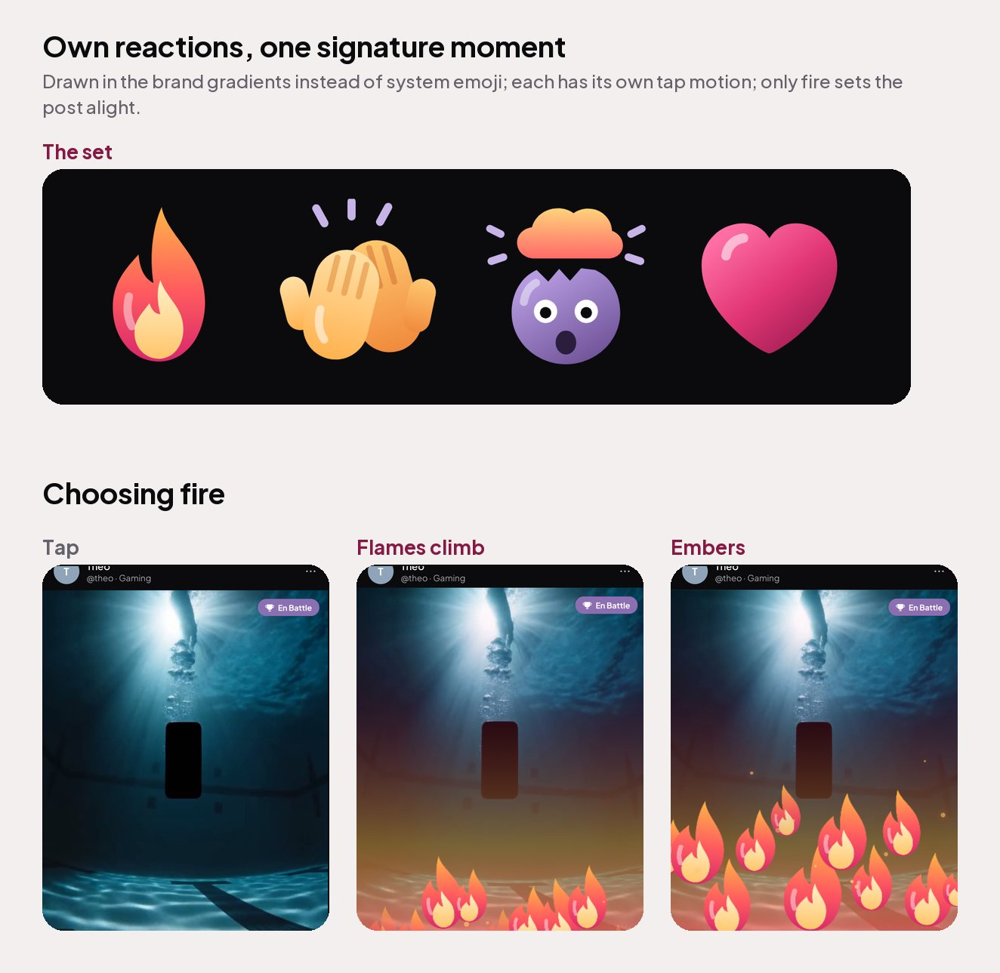

# Lessons from applying the research — VEDYX, September 2026

What changed when the sourced findings in `ux-research.md` met twelve real screens
and a round of founder feedback. Recorded so the next brief starts here, not at the
articles. By Achref Arabi.

## 1 · The tap budget works on browsing screens, not on tool screens

Counting choices in the first viewport cut the home, media, publish and feed screens
without losing anything: extras went into one ⋯, into the content (a tile is the
action), or into a gesture. On the editor the same count produced a toy. Real editors
(Splice, Instagram Reels, VN, CapCut and layout editors) show 5–6
labelled tools in one scrollable band plus undo · redo · save in the header, a play
and full-screen pair, a timecode ruler and a multi-track timeline. Users expect that
density; hiding it reads as "this app can't do it".

Rule that came out of it: **on a tool screen the budget applies per band, not per
screen.** One header band (back · undo · redo · primary), one transport band (play ·
full screen · timecode), one timeline, one tool band of 5–6 labelled tools that
scrolls and **changes with the selection** (nothing selected: Media · Music · Text ·
Split · Delete; clip selected: Trim · Speed · Rotate · Filters · Duplicate). Panels
for a tool rise as a sheet with Cancel · title · Apply and a Reset in the header.

## 2 · Buttons have three sizes and most screens need the small one

Feedback after the first pass: "the buttons are big, some screens don't need this".
The 48–56 pill is right only where the screen exists to make one decision: intro,
export, publish, paywall. Everywhere else it shouts.

- **Hero 48–52**: one per flow end (Commencer, Exporter, Publier, Essayer).
- **Compact 36–40 pill**, 13/600, hugging its text or half width: actions inside a
  browsing screen (Créer une Battle, Participer, Tout voir, Ouvrir).
- **Text 15/600** in the accent: tertiary (Réglages avancés, J'ai déjà un compte).
- **Discs**: 56 for source choices (Filmer · Importer), 44 for media actions (Lire ·
  Modifier · Publier), 32–36 for row pills.

If two screens in a row both end in a hero button, one of them is a step, not a
decision, and it should be compact.

## 3 · What survived unchanged

- Labels on every action icon, tab bar always labelled. No pushback, immediate clarity.
- Plus Jakarta Sans at 500/600/700/800 with JetBrains Mono only for readouts.
- Two levels of disclosure at most. When a third appeared in a draft (Publier ›
  Plus d'options › Visibilité › Qui peut voir) the option moved next to the destination
  tile instead.
- One filled primary per screen state. On the editor that is the header's Save.

## 4 · Things that looked right in the article and wrong on the phone

- "Remove the See all link, the title is tappable": true, but only once the title
  has a chevron. A bare title was not discovered in the simulator.
- "Long-press for the other reactions": fine on a feed, wrong on a Battle where the
  vote must be one obvious tap on the video itself.
- Hiding undo behind a shake on an editor: the reference editors all show undo and
  redo in the header. Undo is not a rare action in a tool; it is the safety net.

---

# Round 2 — the product owner's feedback on the finished screens

Same app, September 2026. The rules above were applied across the whole app, then
the product owner reviewed it on the simulator, screen by screen. Each note below
is what they asked for, what was built, and the rule it became. Screenshots are in
`refs/lessons-img/` (logos blurred); the full before/after is in
`examples/before-after/`.

## 5 · "There is no transition between screens"

Screens swapped with a 200 ms fade and nothing else, and the app felt like a
prototype however good each screen was.

- **Pick the motion from the kind of screen.** A place you drill into slides in from
  the right and follows the back swipe. A task you open and close (search, the
  editor, sign-in, import, a form) rises from the bottom and swipes down. Switching
  tabs cross-fades in about 180 ms.
- **One animation per change.** A container that also faded its content in while the
  stack slid it made the page look washed out mid-transition. Let the navigator
  animate; remove the content fade.
- **Things you touch give way.** Tiles, cards and large round actions ease to about
  96 % on press and spring back; sheets ease out (cubic) rather than moving
  linearly; tool panels rise with a spring.
- **But not the tab bar.** A spring on the active tab icon was the first thing
  removed: "remove the bounce in the tab bar". Tabs dim on press, nothing more.
- Everything respects Reduce Motion.

## 6 · "The app needs a gradient at the top, with the primary colour, a bit grainy"

- **Vertical, not diagonal.** A diagonal gradient never reaches zero at one bottom
  corner and leaves a visible seam where the rect ends. Brand colour at ~34 % under
  the status bar, ~15 % at 30 %, ~6 % at 60 %, 0 at the bottom of a ~380-pt band.
- **Grain needs dark and light specks.** A white-only noise texture disappears on a
  white screen. Mask the grain with the same fade so the texture has no edge.
- **Whatever sits on the glow must let it through.** White list-row backgrounds cut
  hard rectangles into it: rows are transparent at rest. Grey fields turn muddy on
  pink: fields over the glow are frosted white (~72 %).
- **Add a status-bar backdrop that fades in on scroll**, or text runs under the
  clock the moment the glow scrolls away.

## 7 · "The buttons are big" → "compact all the buttons on the whole app"

Rule 13's first numbers were still too large for this owner. Final tiers: main
action 44 pt, dark 40, every other button 36, chips 30 with 13-pt labels, fields 44,
intro button 48, round actions 44–56. Every control under 44 pt keeps a 44-pt touch
area with `hitSlop`, so smaller never means harder to hit. Strip hard-coded heights
from call sites so the tiers actually apply.

## 8 · "Sync can be an icon, local too, people understand these things" (and export, and cloud)

Text tags like "SYNCHRONISÉ", "LOCAL", "EXPORT", "À JOUR", "CLOUD", "HORS-LIGNE"
were read as noise. They became one icon each at the row's trailing edge:
cloud-with-tick (synced), phone (this device only), cloud-with-arrow + % (uploading),
cloud (cloud only), filled down-arrow (downloaded), picture (preview only), a small
brand disc with the export glyph (made in the app). **Problems keep their words**
(conflict, not supported, waiting offline): a warning sign alone does not say what
went wrong. The word always goes to the screen reader.

## 9 · "Most of them are with icons, we don't need to scroll here"

A text tool panel stacked a description, a text area, three rows of word buttons
(Haut / Milieu / Bas, Gauche / Centre / Droite, S / M / L) and number fields, and
scrolled. It now fits on one screen: one field with a clear button; position and
alignment as icon segments on one grey track; colour swatches and size ("A" at three
sizes) side by side; display time as two −/+ steppers. **A tool panel must fit
without scrolling; formatting choices are icons.**

## 10 · "A whole different design, but the same family"

The app has a second space (a community of battles and posts) that looked like a
tinted copy of the first. It became a **night stage**: black ground, the second
brand colour as light and action, the same typeface, icon set, radii, components and
grain. A theme scope lifts text, fields, chips, buttons, rows, tags and sheets
automatically, so no component is forked. The tab bar and status bar turn dark with
it. Its logo reuses the main wordmark's letter construction (shared letters kept
exactly, new letters drawn on the same curves), so the two read as siblings.

Then: "change the tab bar with these tabs on VYRA and add a fifth, VEDYX, with the X
logo". **A second space gets its own tab bar**, its sections as tabs (the chips under
the title go), and the way back to the main space as a tab with the main logo —
placed first on the left, where it is always in the same place. Its three main
places got **illustrated icons** (brand gradients when chosen, flat grey silhouettes
at rest); the profile tab stays a simple outline.

## 11 · "I want to create our own emojis" · "make them animated" · "the whole post gets fired"

- **Own the reaction set.** Four reactions drawn in the brand gradients (flame,
  clapping hands, mind blown, heart) instead of the system emoji font: they look the
  same on every phone and belong to the stage.
- **Each one moves in character** on tap: the heart beats twice, the flame flickers,
  the hands clap, the head shakes; choosing one sends a copy floating up.
- **One signature moment, not four.** Only fire sets the whole post alight (a warm
  wash, flames climbing from the bottom edge, embers, a heat pulse on the picture).
  Giving every reaction an effect would make none of them special.

## 12 · Smaller notes that became defaults

- Chips were too big ("make them smaller"): 30 pt with 13-pt labels.
- Screenshots and review happen on the simulator, never in a browser build.
- Replace placeholder art with real pictures before judging a design; stripes hide
  every spacing problem.
- A status bar style set by one dark screen lingers on the white screens after it:
  set it per route (and per overlay, a frame after the route's own style).

